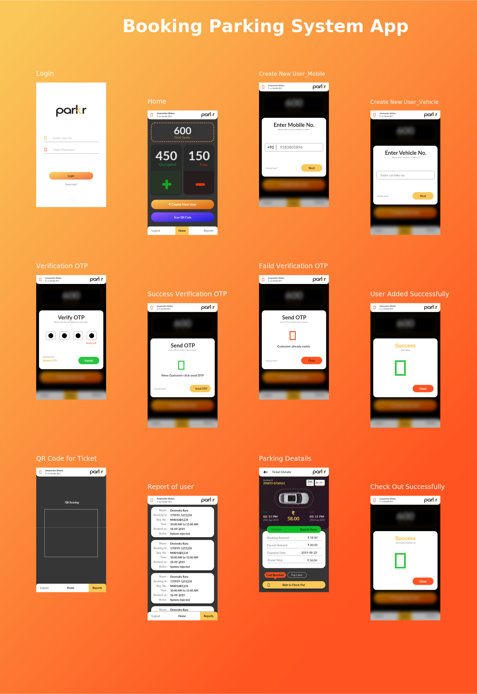

# Flutter Booking Parking App 

A Flutter starter Booking Parking App, It has following features:

  - Manage The Parking Places by Check-In and Check-Out
  - Scan your ticket and show the all deatils about this car 
  - Report for all the ticket status on this parking
  - Runs on both Android & IOS.

### Screenshots:
 

### Dependencies

This project is built with various awesome open sourced libraries

* [http](https://pub.dev/packages/http) -  to communicate with the API.
* [flutter_masked_text](https://pub.dev/packages/flutter_masked_text) - to Masked text input for flutter.
* [shared_preferences](https://pub.dev/packages/shared_preferences) - to saved the auth of the user.

## Can I hire you guys?
Yes! We are available for hire. Visit [My Profile](https://github.com/mahmoudalaa97). We will be happy to work with you!